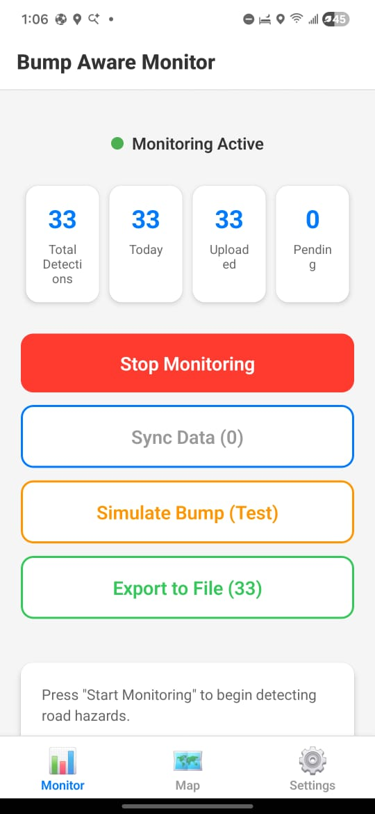
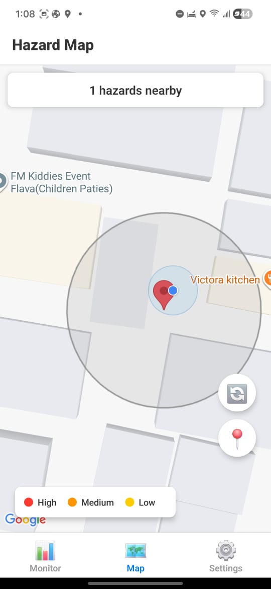
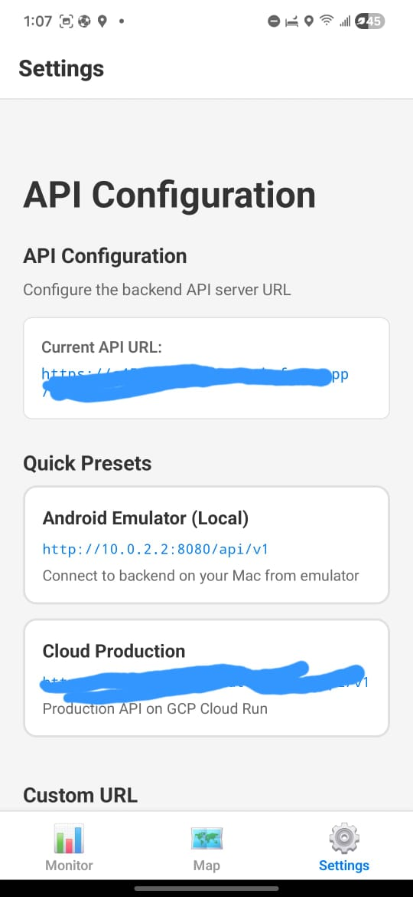

# Bump Aware Map

A crowd-sourced road hazard detection and alerting system that uses mobile sensors to identify, validate, and warn drivers about potholes, speed bumps, and other road anomalies.

## Screenshots

<table>
  <tr>
    <td></td>
    <td></td>
    <td></td>
  </tr>
  <tr>
    <td align="center">Monitor Screen</td>
    <td align="center">Map View</td>
    <td align="center">Settings</td>
  </tr>
</table>

## System Overview

Bump Aware Map combines mobile sensor data collection, cloud-based spatial analysis, and real-time alerting to create a dynamic map of road hazards. The system validates detections through spatial clustering and consensus mechanisms, ensuring high accuracy while minimizing false positives.

## Architecture

### Mobile Application (React Native)
- Background sensor monitoring (accelerometer + gyroscope at 100-200Hz)
- GPS location tagging (<10m accuracy)
- Batched detection uploads to minimize battery drain
- Interactive map view with Google Maps integration
- Tab-based navigation (Monitor, Map, Settings)
- Configurable API endpoint settings
- User authentication with JWT tokens
- Real-time hazard display on map

### Backend Infrastructure (Python/FastAPI)
- PostgreSQL/PostGIS geospatial database with spatial indexing
- RESTful API with batched uploads
- Spatial clustering (DBSCAN algorithm) for hazard detection
- Admin endpoints for manual detection processing
- User authentication and authorization
- Real-time hazard queries by location/bounds
- Hazard verification system for crowdsourced validation
- Comprehensive API documentation (Swagger/OpenAPI)

## Project Structure

```
hazard-aware-map/
├── mobile/                 # React Native mobile application
│   ├── android/           # Android-specific code
│   ├── ios/               # iOS-specific code (future)
│   ├── src/
│   │   ├── services/      # Sensor monitoring, GPS, data sync
│   │   ├── storage/       # SQLite database layer
│   │   ├── screens/       # UI components
│   │   └── utils/         # Sensor fusion, detection algorithms
│   └── README.md
│
├── backend/               # Python FastAPI backend
│   ├── app/
│   │   ├── api/          # RESTful endpoints
│   │   ├── core/         # Configuration, security
│   │   ├── db/           # Database models and migrations
│   │   ├── services/     # Business logic
│   │   │   ├── clustering.py      # DBSCAN spatial clustering
│   │   │   ├── validation.py      # Hazard validation
│   │   │   ├── alerts.py          # Alert generation
│   │   │   └── aggregation.py     # Data aggregation
│   │   └── models/       # Pydantic schemas
│   ├── requirements.txt
│   └── README.md
│
└── docs/                 # Additional documentation
    ├── ARCHITECTURE.md
    ├── API.md
    └── DEPLOYMENT.md
```

## Key Features

### Phase 1: Mobile Application

**Sensor Monitoring**
- Tri-axial accelerometer data capture (100-200Hz)
- Gyroscope integration for sensor fusion
- Background monitoring with battery optimization
- Intelligent event detection algorithms

**Data Management**
- Local SQLite storage for offline capability
- Batched uploads to minimize battery drain
- GPS location tagging with <10m accuracy
- Efficient data compression

**User Interface**
- Real-time detection statistics
- App status monitoring
- Configurable sensitivity settings
- Battery usage optimization controls

### Phase 2: Backend Infrastructure

**Geospatial Database**
- PostgreSQL with PostGIS extension
- Spatial indexing for fast queries
- Support for 10,000+ concurrent users
- Optimized for mobile data constraints

**Hazard Validation System**
- Spatial clustering (15-20m radius)
- Temporal weighting (30-day priority window)
- Consensus mechanism (minimum 3 independent detections)
- Time-decay function (90-day confidence reduction)
- Outlier detection and filtering
- Vehicle-type normalization
- Manual verification pathway

**Alert Generation**
- Speed-based warning distances (15-30 second lead time)
- Dynamic prioritization: severity × confidence × proximity
- Alert suppression to prevent fatigue (max 1 per 500m)
- Predictive route-based queuing
- Customizable sensitivity levels
- Geofencing for power optimization

## Technology Stack

### Mobile
- **Framework**: React Native (cross-platform iOS/Android support)
- **Language**: TypeScript/JavaScript
- **Sensors**: React Native Sensors, React Native Background Actions
- **Storage**: React Native SQLite Storage
- **Location**: React Native Geolocation Service
- **Maps**: React Native Maps

### Backend
- **Framework**: FastAPI (Python 3.11+)
- **Database**: PostgreSQL 15+ with PostGIS extension
- **ORM**: SQLAlchemy with GeoAlchemy2
- **Authentication**: JWT tokens
- **Clustering**: scikit-learn (DBSCAN)
- **Async**: asyncio, asyncpg
- **API Docs**: OpenAPI/Swagger (built into FastAPI)

### Infrastructure
- **Container**: Docker & Docker Compose
- **Web Server**: Uvicorn with Gunicorn workers
- **Reverse Proxy**: Nginx (production)
- **Monitoring**: Prometheus + Grafana (future)
- **CI/CD**: GitHub Actions (future)

## Quick Start

### Prerequisites
- Node.js 18+ and npm/yarn
- Python 3.11+
- Docker & Docker Compose
- Android device or emulator (for testing)
- Google Maps API key (for map functionality)
- ngrok account (for local development with physical devices)

### 1. Backend Setup with Docker (Recommended)

```bash
# Clone the repository
git clone https://github.com/yourusername/hazard-aware-map.git
cd hazard-aware-map

# Start the backend services
docker-compose up -d
```

This starts:
- PostgreSQL with PostGIS on port 5432
- Backend API on port 8080
- pgAdmin on port 5050

Access API documentation at: http://localhost:8080/docs

### 2. Process Initial Detections

After uploading detections from the mobile app, process them into hazards:

```bash
curl -X POST http://localhost:8080/api/v1/admin/process-detections
```

### 3. Mobile App Setup

```bash
cd mobile
npm install

# Copy the Maps config template
cp src/services/MapsConfigService.ts.example src/services/MapsConfigService.ts

# Build for Android
npx react-native run-android
```

**Important Setup Steps:**

1. **Configure Google Maps API Key**: In the app, go to Settings → Google Maps API Key and enter your key
2. **Configure API URL**:
   - For local development with physical device, use ngrok (see below)
   - Go to Settings → API Base URL and enter your endpoint

See [mobile/README.md](mobile/README.md) and [LOCAL_DEVELOPMENT.md](LOCAL_DEVELOPMENT.md) for detailed setup instructions.

### 4. Local Development with ngrok (Physical Devices)

Android physical devices cannot reach `localhost` or local network IPs due to cleartext traffic restrictions. Use ngrok to expose your local backend:

```bash
# Install ngrok
brew install ngrok  # macOS
# or download from https://ngrok.com/download

# Start ngrok tunnel to your backend
ngrok http 8080

# Copy the HTTPS URL (e.g., https://abc123.ngrok.io)
# In the mobile app, set API Base URL to: https://abc123.ngrok.io/api/v1
```

**Note**: The free ngrok tier provides a random URL that changes each session. For persistent URLs, upgrade to a paid plan or use a local network IP with network security configuration (see LOCAL_DEVELOPMENT.md).

### Using Docker Compose (Recommended)

```bash
docker-compose up -d
```

This will start:
- PostgreSQL with PostGIS on port 5432
- Backend API on port 8080
- pgAdmin on port 5050 (optional)

## API Documentation

Once the backend is running, access interactive API documentation at:
- Swagger UI: http://localhost:8080/docs
- ReDoc: http://localhost:8080/redoc

## Current Status

### Completed Features

**Mobile Application**
- ✅ Tab-based navigation (Monitor, Map, Settings)
- ✅ Background sensor monitoring (accelerometer + gyroscope)
- ✅ GPS location tracking
- ✅ Batched detection uploads
- ✅ Google Maps integration with hazard markers
- ✅ Configurable API endpoint
- ✅ User authentication (login/register/logout)
- ✅ Google Maps API key configuration

**Backend Infrastructure**
- ✅ PostgreSQL with PostGIS geospatial database
- ✅ RESTful API with FastAPI
- ✅ User authentication with JWT tokens
- ✅ Detection batch upload endpoint
- ✅ Spatial clustering service (DBSCAN)
- ✅ Admin endpoints for manual processing
- ✅ Hazard query endpoints (nearby, bounds)
- ✅ Hazard verification system
- ✅ Docker containerization
- ✅ API documentation (Swagger/OpenAPI)

### In Progress
- 🔄 Automated background processing (currently manual via admin endpoint)
- 🔄 Alert generation system
- 🔄 iOS support

### Roadmap
- ⏳ Machine learning hazard classification
- ⏳ Predictive routing and alert queuing
- ⏳ Production deployment
- ⏳ Monitoring and analytics dashboard

## System Requirements

### Mobile App
- Android 8.0+ (API level 26+)
- GPS capability
- Accelerometer and gyroscope sensors
- Minimum 2GB RAM
- Internet connectivity (3G/4G/5G/WiFi)

### Backend
- 4+ CPU cores (recommended)
- 8GB+ RAM
- 50GB+ storage (scales with user base)
- Linux server (Ubuntu 22.04+ recommended)

## Performance Targets

- Mobile sensor sampling: 100-200Hz
- GPS accuracy: <10m
- API response time: <200ms (p95)
- Alert lead time: 15-30 seconds
- Concurrent users: 10,000+
- Battery impact: <5% per hour of active monitoring

## Security Considerations

- User authentication via JWT tokens
- HTTPS/TLS encryption for all API communication
- GPS data anonymization options
- Rate limiting on API endpoints
- SQL injection protection via ORM
- Input validation on all endpoints
- Privacy-focused data retention policies

## Contributing

Contributions are welcome! Please follow these guidelines:
1. Fork the repository
2. Create a feature branch (`git checkout -b feature/amazing-feature`)
3. Commit your changes (`git commit -m 'Add amazing feature'`)
4. Push to the branch (`git push origin feature/amazing-feature`)
5. Open a Pull Request

**Before submitting:**
- Ensure all tests pass
- Update documentation as needed
- Follow existing code style
- Add screenshots for UI changes

## Setup for Contributors

### Required Configuration Files

The following files are gitignored and must be created locally:

1. **Google Maps API Key**: Copy the template and add your key
   ```bash
   cp mobile/src/services/MapsConfigService.ts.example mobile/src/services/MapsConfigService.ts
   # Then add your Google Maps API key in the Settings screen
   ```

2. **Android/iOS Native Folders**: These are excluded from git. Generate them with:
   ```bash
   cd mobile
   npx react-native run-android  # Generates android folder
   ```

3. **Environment Variables**: Create `.env` file in backend directory (see backend/README.md)

See [LOCAL_DEVELOPMENT.md](LOCAL_DEVELOPMENT.md) for complete setup instructions.

## License

MIT License - see [LICENSE](LICENSE) file for details

## Contact

For questions or support, please open an issue on GitHub.

## Acknowledgments

- DBSCAN clustering algorithm
- OpenStreetMap for geospatial data
- React Native community
- FastAPI framework
